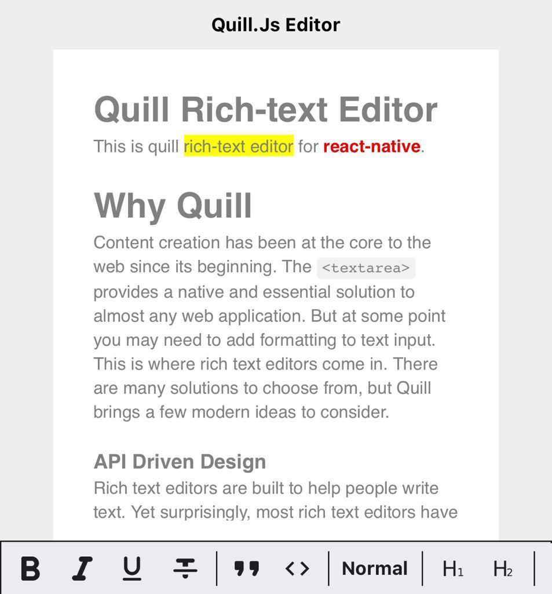

# react-native-cn-quill

react-native-cn-quill is a rich-text editor for react-native. We've developed this library on top of Quill Api.  



## Why Quill
Quill is a free, open source WYSIWYG editor built for the modern web. Completely customize it for any need with its modular architecture and expressive API. Read more [here](https://quilljs.com/guides/why-quill/).

## Prerequisite
This package is using `react-native-webview`. Please follow [this document](https://github.com/react-native-community/react-native-webview/blob/master/docs/Getting-Started.md) to install it.

## Installation

#### Install using npm:

```sh
npm i react-native-cn-quill
```
#### Install using yarn:

```
yarn add react-native-cn-quill
```

## Usage

Here is a simple overview of our components usage.

```js
import React from 'react';
import { SafeAreaView, StyleSheet, Text, View, KeyboardAvoidingView, StatusBar } from 'react-native';
import QuillEditor, { QuillToolbar } from 'react-native-cn-quill';
export default function App() {
  const _editor = React.createRef();

  return (
    <SafeAreaView style={styles.root}>
      <Text style={styles.title}>Quill Editor</Text>
      <KeyboardAvoidingView style={styles.container}
        behavior={Platform.OS === 'ios' ? 'padding' : 'height'}>
        <View style={styles.editor}>
          <QuillEditor ref={_editor} />
        </View>
        <View>
          <QuillToolbar editor={_editor} options="full" theme="light" />
        </View>
        <StatusBar style="auto" />
      </KeyboardAvoidingView>
    </SafeAreaView>
  );
}

const styles = StyleSheet.create({
  title: {
    fontWeight: 'bold',
    alignSelf: 'center',
    paddingVertical: 10,
  },
  root: {
    flex: 1,
    backgroundColor: '#eee',
  },
  container: {
    flex: 1,
  },
  editor: {
    flex: 1,
    marginHorizontal: 40,
    backgroundColor: '#fff',
    padding: 15,
  },
});
```
## QuillEditor
QuillEditor is the main component of this library. You may easily add it to your application. It is also a wrapper for Quill and provides most of it's functionalities.  

### QuillEditor Props

| Name | Description | Required |
| ------ | ----------- | ---- |
| style | Styles applied to the outermost component. | No |


### Instance methods

Read about these methods and their functionality on [Quill Api](https://quilljs.com/docs/api/)

| Name | Params | Returns | type |
| ------ | ---- | ------ | --- |
| blur | - | void | Editor |
| focus | - | void | Editor |
| disable | - | void | Editor |
| enable | `enable?` | void | Editor |
| hasFocus | - | `Promise<boolean>` | Editor |
| update | - | void | Editor |
| format | `name: string, value: any` | void | Formating |
| deleteText | `index: number, length: number` | void | Content |
| getContents | `index?: number, length?: number` | `Promise` | Content |
| getLength | - | `Promise` | Content |
| getHtml | - | `Promise` | Content |
| getText | `index?: number, length?: number` | `Promise` | Content |
| insertEmbed | `index: number, type: string, value: any` | void | Content |
| insertText | `index: number, text: string, formats?: Record<string, any>` | void | Content |
| setContents | `delta: any` | void | Content |
| setText | `text: string` | void | Content |
| updateContents | `delta: any` | void | Content |
| on | - | `event: EditorEventType, handler: Function` | Event `(under development)` |
| off | - | `event: EditorEventType` | Event `(under development)`|

## QuillToolbar
The QuillToolbar component allow users to easily format Quill’s contents. QuillToolbar controls can be specified by a simple array of format names like `['bold', 'italic', 'underline', 'strike']` or by just passing 'basic' or 'full' string to options prop. we've tried to develop it just like [Quill Toolbar options](https://quilljs.com/docs/modules/toolbar/#container).
The QuillToolbar uses a series of icons to render controls. this controls by default applies and removes formatting, but you can easily extend or overwrite these with `custom` prop.  
For example we may add the `image` and `clock` (user defined control that inserts current date to the editor) handlers just like this:
```
...
  const clockIcon = require('../assets/icons/clock.png');

  customHandler = (name: string, value: any) => {
    if (name === 'image') {
      this._editor.current?.insertEmbed(
        0,
        'image',
        'https://picsum.photos/200/300'
      );
    } else if (name === 'clock') {
      this._editor.current?.insertText(0, `Today is ${this.getCurrentDate()}`, {
        bold: true,
        color: 'red',
      });
    } else {
      console.log(`${name} clicked with value: ${value}`);
    }
  };

  render() {
    ...
        <QuillToolbar
          editor={this._editor}
          options={['image', 'clock']}
          theme="light"
          custom={{
            handler: this.customHandler,
            actions: ['image', 'clock'],
            icons: {
              clock: clockIcon,
            },
          }}
        />
        ...
  }

```
To see an example of how to fully implement this please check this [Link](https://github.com/imnapo/react-native-cn-quill/blob/master/example/src/App.tsx).  

### QuillToolbar Props

| Name | Description | Required |
| ------ | ----------- | ---- |
| styles | `{ toolbar?, toolset?, tool? }` | No |
| editor | `React.RefObject<QuillEditor>` | Yes |
| theme | `'dark' , 'light', ToolbarTheme (ex: { size: 30, color: 'white', background: 'gray', overlay: 'rgba(0,0,0,.5')})` | false |
| options | `'full' , 'basic', array (ex: [['bold', 'italic'], ['link', 'image']])` | Yes |
| custom | `{ handler?: (name: string, value: any) => void; actions?: Array<string>; icons?: Record<string, any>; }` | No |

## Contributing

See the [contributing guide](CONTRIBUTING.md) to learn how to contribute to the repository and the development workflow.

## License

MIT
